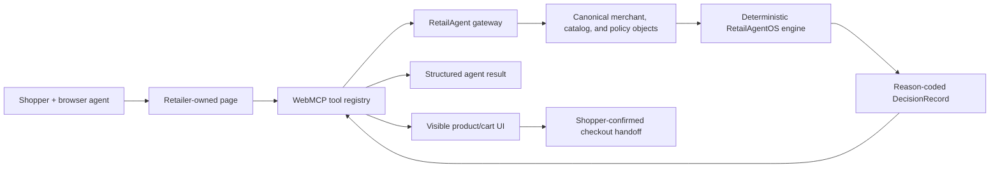

# Technical evidence and architecture

## Business outcome first

RetailAgentOS lets an AI shopping agent take safe, useful action on a retailer-owned website without interpreting DOM structure or inventing missing commerce facts. It exposes only bounded capabilities, explains decisions, updates the visible page, and reserves checkout for the shopper.

## Architecture



## Tool inventory

| Tool | Purpose | Safety behavior | Visible effect |
|---|---|---|---|
| `search_products` | Find bounded catalog candidates | Read-only; results include eligibility hints and untrusted-content annotation | Candidate list can be shown |
| `evaluate_offer` | Check a product and quantity against merchant rules | Read-only; delegates to the deterministic engine | Selects/focuses product and displays reason |
| `prepare_cart` | Re-evaluate every line and prepare a reviewable cart | Idempotency key; no autonomous checkout | Renders cart for shopper review |
| `request_quote` | Capture custom-order quantity and requirements | Idempotency key; never invents fixed price | Shows quote reference and merchant-review step |

## Current code evidence

- WebMCP SDK and schemas: `packages/webmcp/src/index.ts`
- Browser feature adapter: `packages/webmcp/src/browser.ts`
- WebMCP contracts: `packages/webmcp/src/types.ts`
- SDK tests: `packages/webmcp/src/index.test.ts`
- Deterministic showcase gateway: `src/lib/showcase/gateway.ts`
- Gateway tests: `src/lib/showcase/gateway.test.ts`
- Search route: `src/app/api/showcase/products/search/route.ts`
- Offer route: `src/app/api/showcase/offers/evaluate/route.ts`
- Cart route: `src/app/api/showcase/carts/prepare/route.ts`
- Quote route: `src/app/api/showcase/quotes/request/route.ts`
- Storefront showcase: `src/app/agent-ready-storefront/`
- Build/status record: `specs/WEBMCP-PLATFORM-BUILD.md`

## Registration pattern to make visible in the public README

The production package wraps this pattern so applications can inject their own gateway and storefront bridge:

```ts
const controller = new AbortController();

await document.modelContext.registerTool(
  {
    name: 'search_products',
    description: 'Find products that match the shopper request.',
    inputSchema: {
      type: 'object',
      properties: {
        query: { type: 'string', maxLength: 240 },
        limit: { type: 'integer', minimum: 1, maximum: 12 },
      },
      required: ['query'],
      additionalProperties: false,
    },
    execute: async ({ query, limit }) =>
      gateway.searchProducts({ query, limit, buyerContext: storefront.getBuyerContext() }),
  },
  { signal: controller.signal },
);

// Abort owns cleanup when the page lifecycle ends.
controller.abort();
```

Keep the snippet synchronized with the actual tested API; it is evidence for judges, not an alternate implementation.

## Safety and trust properties

- The model does not decide eligibility, inventory, price, fulfillment, or quote status.
- All commerce facts come from the deterministic engine.
- Browser and route layers map results; they do not recalculate them.
- Time enters at an explicit application boundary.
- Tool inputs are bounded.
- Cart lines are re-evaluated before preparation.
- Mutating preparation calls require idempotency keys.
- Checkout is outside the autonomous tool set.
- A quote request returns `fixedPrice: null` until a merchant supplies a quote.
- Unsupported browsers get an honest fallback experience.

## Honest limitations for the submission

- The challenge catalog is a local deterministic fixture, not a live TheCustomHub connection.
- The showcase is not production multi-tenant SaaS.
- There is no live Etsy OAuth, catalog sync, or ability to control Etsy pages or checkout.
- Authentication, durable persistence, rate limiting, payments, and production telemetry are not implemented here.
- WebMCP remains experimental and browser-dependent.

These limitations do not weaken the challenge proof if the native tools work: the submission demonstrates the reusable browser/engine boundary and the complete human-agent workflow it enables.
